Many data systems use polling refresh to display lists, which can cause a delay in updating content status and cannot immediately provide feedback to users on the page. Shortening the refresh time interval on the client side can lead to an excessive load on the server, which should be avoided.

To solve this problem, this article proposes an event subscription mechanism. This mechanism provides real-time updates to the client, eliminating the need for polling refresh and improving the user experience.

# Terminologies and Context

This article introduces the following concepts:

- **Hub**: An event aggregation center that receives events from producers and sends them to subscribers.
- **Buffer**: An event buffer that caches events from producers and waits for the Hub to dispatch them to subscribers.
- **Filter**: An event filter that only sends events meeting specified conditions to subscribers.
- **Broadcast**: An event broadcaster that broadcasts the producer's events to all subscribers.
- **Observer**: An event observer that allows subscribers to receive events through observers.

The document discusses some common concepts such as:

- Pub-Sub pattern: It is a messaging pattern where the sender (publisher) does not send messages directly to specific recipients (subscribers). Instead, published messages are divided into different categories without needing to know which subscribers (if any) exist. Similarly, subscribers can express interest in one or more categories and receive all messages related to that category, without the publisher needing to know which subscribers (if any) exist.
- Filter:
    - Topic-based content filtering mode is based on topic filtering events. Producers publish events to one or more topics, and subscribers can subscribe to one or more topics. Only events that match the subscribed topics will be sent to subscribers. However, when a terminal client subscribes directly, this method has too broad a subscription range and is not suitable for a common hierarchical structure.
    - Content-based content filtering mode is based on message content filtering events. Producers publish events to one or more topics, and subscribers can use filters to subscribe to one or more topics. Only events that match the subscribed topics will be sent to subscribers. This method is suitable for a common hierarchical structure.

## Functional Requirements

- Client users can subscribe to events through gRPC Stream, WebSocket, or ServerSentEvent.
- Whenever a record's status changes (e.g. when the record is updated by an automation task) or when other collaborators operate on the same record simultaneously, an event will be triggered and pushed to the message center.
- Events will be filtered using content filtering mode, ensuring that only events that meet the specified conditions are sent to subscribers.

# Architecture

## High-Level Overview

```mermaid
flowchart TD
  Pipe#a[[...Pipe...]]
  Pipe#b[[...Pipe...]]
  subgraph Hub
  direction LR
  Event1((Event1))
	Event2((Event2))
  Event3((Event3))
  Event4((Event4))
  Event5((Event5))
  Event6((Event6))
  Event7((Event7))
  Event8((Event8))
  Event1 -.-> Event2 -.-> Event3 -.-> Event4 -.-> Event5 -.-> Event6 -.-> Event7 -.-> Event8
  end
	Pipe#a -.-> Event1
  Event8 -.-> Pipe#b
  subgraph Client1
  direction LR
  C1Subscribe((Start))
  C1Cancel((End))
  Event2 -.-> C1Listen2
  Event3 -.-> C1Listen3
  Event4 -.-> C1Listen4
  Event5 -.-> C1Listen5
  C1Subscribe -.-> C1Listen2 -.-> C1Listen3 -.-> C1Listen4 -.-> C1Listen5 -.-> C1Cancel
  end
  subgraph Client2
  direction LR
  C2Subscribe((Start))
  C2Cancel((End))
  Lag(("❌"))
  C2Subscribe -.-> C2Listen1 -- "Poor Network" ---> Lag --"Packet loss"---> C2Listen5 -.-> C2Listen6 -.-> C2Listen7 -.-> C2Listen8 -.-> C2Cancel
  Event1 -.-> C2Listen1
  Event5 -.-> C2Listen5
  Event6 -.-> C2Listen6
  Event7 -.-> C2Listen7
  Event8 -.-> C2Listen8
  end
```

Clients should follow these steps:

- Upon entering the page, subscribe as necessary.
- After listening to the change event, debounce and re-request the list interface, and then render it.
- When leaving the page, cancel the subscription.

Servers should follow these steps:

- Subscribe to push events based on the client's filter.
- When the client's backlog message becomes too heavy, delete the oldest message from the buffer.
- When the client cancels the subscription, the server should also cancel the broadcast to the client.

## **Application / Component Level Design (LLD)**

For a single-node server, a simple Hub can be implemented using an in-memory queue.

For multi-node servers, an external Hub implementation such as Kafka, MQ, or Knative eventing should be considered. The broadcasting logic is no different from that of a single machine.

## **Failure Modes**

### Fast Producer-Slow Consumer

This is a common scenario that requires special attention. The publish-subscribe mechanism for terminal clients cannot always expect clients to consume messages in real time. However, message continuity must be maximally guaranteed. Clients may access our products in an uncontrollable network environment, such as over 4G or poor Wi-Fi. Thus, the server message queue cannot become too backlogged. When a client's consumption rate cannot keep up with the server's production speed, this article recommends using a bounded `Buffer` with the `OverflowStrategy.DropOldest` strategy. This ensures that subscriptions between consumers are isolated, avoiding too many unpushed messages on the server (which could lead to potential memory leak risks).

# Alternative Design

[VMware has publish a very similar design in 2013, but use Go RingChannel](https://tanzu.vmware.com/content/blog/a-channel-based-ring-buffer-in-go)

# Summary

This document proposes an event subscription mechanism to address the delay in updating content status caused by polling refresh. Clients can subscribe to events through any long connection protocol, and events will be filtered based on specified conditions. To avoid having too many unpushed messages on the server, a bounded buffer with the `OverflowStrategy.DropOldest` strategy is used.

Implementing this in Reactive Streams is straightforward, but you can choose your preferred technology to do so.