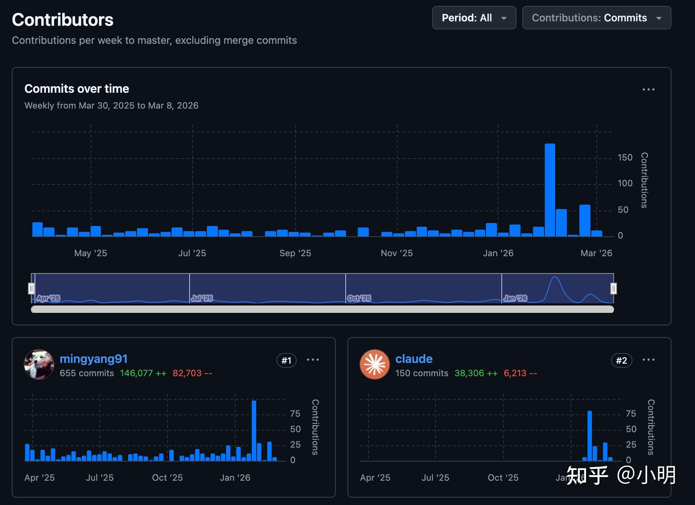

# 观前提醒
该文件为我个人自用的CLAUDE.md规则文件，维护生产项目已有一年时间，从 Cursor + opus 3.7 时代至现在Claude-Code + opus 4.6时代。

请注意：该文件也**仅可用于 Claude code opus 4.6**，我不是对 codex 和 gemini 有偏见，OpenAI 的 25k USD credits 今年6月份就要过期了，它（gpt-5.4-xhigh/codex-5.3-xhigh）要是真有自媒体和AI教父们宣传的那么牛逼plus，我能把这些credits放过保质期？

实测效果就是 codex 对函数式编程风格遵循不理想，对 opus 4.6 有效的简短提示词，你不掰开揉碎了讲给 AGENTS.md 它必定会跑偏。

因为编码风格，个人品味原因，**请勿整段复制甚至替换掉你的规则文件**。你可以让 Claude 阅读我的规则文件，分析后你再决定有哪些可以采纳，有哪些不适合你当前项目。我个人的编码和架构风格非常激进，因为许多代码/系统烂是烂在骨子里的，在这些屎山系统上打“优雅”的补丁实际上还是在推高屎山的海拔，而并没有真的降低技术债务。所以我的架构设计风格从来是大胆激进，没什么不能改也没什么不敢改的，活着的系统一定要经常重新审视，只要能降低技术债务，要敢于进行局部甚至底朝天的重写；只有死了的系统才是永恒不变的。

这是我的项目在 vibe 一年后的提交统计图，受到 opus 4.6 1M-context 的帮助，最近一个月我用 5k usd token 烧出了7-8 个超大型 feature 和从 Kotlin 到 Scala 的彻底重写，代码量也大幅降低到了3万行出头，系统健康程度远超半年前。

---

# CLAUDE.md

This file provides guidance to Claude Code (claude.ai/code) when working with code in this repository.

## Overview

A multi-tenant backend service built with **http4s** (Scala 3 / cats-effect). It provides document management, AI-powered features (embeddings, RAG), video SOP generation, and real-time communication capabilities.

## Refactoring Philosophy

**Prefer radical type-level refactors over conservative patches.** This is a statically-typed Scala 3 codebase with tagless final — the compiler catches all downstream breakage. When fixing an issue, always choose the solution that encodes the constraint in the type system, even if it touches many files. A 15-file signature change that the compiler verifies is **safer** than a 1-file patch with a runtime check.

- **Don't minimize blast radius — maximize type safety.** Changing a method from `List[T]` to `NonEmptyList[T]` across 6 files is not "risky" — the compiler finds every call site. A runtime `.toNel.get` hidden in one file is the real risk.
- **The compiler is the last line of defense.** If a refactor compiles, it's correct. Treat compilation as the acceptance test for type-level changes.
- **Write-cost is near zero.** AI writes 90%+ of code, so the cost of touching more files is negligible. Optimize for correctness and compile-time safety, not for minimal diff.
- **Type precision is not over-engineering.** Over-engineering means unnecessary abstractions, config flags, strategy patterns for one implementation. Using `NonEmptyList` over `List`, `ProjectId` over `UUID`, or propagating constraints through signatures is the opposite — it removes complexity (runtime checks) by shifting it to the compiler. "Avoid over-engineering" applies to architecture, not to type-level precision.

## Technology Stack

- **Framework:** http4s 0.23.33 (Ember server)
- **Language:** Scala 3.8.1
- **Runtime:** Java 25 (Amazon Corretto)
- **Build:** Mill 1.1.2
- **Database:** PostgreSQL 42.7.3 + pgvector extension + ltree extension
- **ORM:** Doobie 1.0.0-RC11
- **Auth:** Firebase Admin SDK 9.4.3
- **AI:** Google Cloud Vertex AI (embeddings, GenAI, RAG), Google GenAI SDK
- **Migrations:** Flyway 11.7.2
- **Scheduler:** Quartz 2.5.0
- **Observability:** otel4s 0.15.0 (OpenTelemetry), Sentry error tracking
- **Container Orchestration:** Optional Kubernetes integration for video processing jobs

## Build & Run Commands

```bash
# Compile
./mill compile

# Run (dev)
./mill run

# Run all tests
./mill test

# Build classpath distribution (lib/ with all JARs)
./mill dist

# Format code
./mill reformat

# Check formatting
./mill checkFormat

# Clean build artifacts
./mill clean
```

**Database setup:**
```bash
# Start PostgreSQL with pgvector extension
docker-compose up -d

# Stop database
docker-compose down
```

## Project Structure

```
src/main/scala/com/example/
├── App.scala                   # Main entry point (IOApp.Simple)
├── core/                       # Shared infrastructure
│   ├── auth/                   # Firebase auth, claims parsing
│   ├── config/                 # AppConfig (pureconfig HOCON)
│   └── database/               # Doobie transactor, multi-tenant, Flyway
├── features/                   # Feature modules
│   ├── bookmark/               # Bookmark management
│   ├── chat/                   # Chat sessions
│   ├── copy/                   # Content copy
│   ├── document/               # Document CRUD, embeddings, GCS
│   ├── folder/                 # Folder management
│   ├── librechat/              # LibreChat integration
│   ├── mfareset/               # MFA reset
│   ├── permission/             # Resource-scoped permissions
│   ├── project/                # Projects, membership, RBAC
│   ├── quota/                  # Usage quota tracking
│   ├── rag/                    # RAG indexing & retrieval (pgvector)
│   ├── reindex/                # Reindex jobs
│   ├── settings/               # System/tenant settings
│   ├── sop/                    # SOP generation (video → steps)
│   ├── system/                 # Tenant admin endpoints
│   ├── transcode/              # Video transcoding
│   ├── user/                   # User profiles & preferences
│   ├── video/                  # Video clips, descriptions, fingerprints
│   └── webauthn/               # WebAuthn/passkeys
├── http/                       # HTTP layer
│   ├── routes/                 # Route handlers
│   ├── AuthMiddleware.scala
│   └── ErrorHandlingMiddleware.scala
├── infrastructure/             # External integrations
│   ├── firebase/               # Firebase auth & email
│   ├── ffmpeg/                 # FFmpeg wrapper
│   ├── gcs/                    # Google Cloud Storage
│   ├── genai/                  # Gemini video analysis
│   ├── kubernetes/             # K8s job delegation
│   ├── sentry/                 # Error tracking
│   ├── telemetry/              # otel4s tracing
│   ├── videointelligence/      # Video Intelligence API
│   ├── videoseal/              # Neural watermarking
│   └── vertexai/               # Vertex AI, MCP server (30 tools)
└── jobs/                       # Quartz job schedulers
```

## Configuration

Main config: `src/main/resources/application.conf` (HOCON format, parsed by pureconfig)

**Environment Variables:**
- `DATABASE_URL` - PostgreSQL JDBC URL (or `secrets/database/url` file)
- `JWT_SECRET` - JWT signing secret
- `GCS_BUCKET` - GCS bucket for documents
- `GCS_HOSTNAME` - Optional GCS hostname
- `TRANSCODE_GCS_BUCKET` - GCS bucket for transcoded videos
- `TRANSCODE_GCS_HOSTNAME` - Optional transcode GCS hostname
- `ENABLE_OTEL` - Enable OpenTelemetry (fallback: false)
- `SENTRY_DSN` - Sentry error tracking DSN (optional)
- `SENTRY_ENV` - Sentry environment (fallback: "development")
- `KUBERNETES_JOBS_ENABLED` - Enable K8s job delegation for video processing (fallback: false)
- `KUBERNETES_NAMESPACE` - K8s namespace for jobs (fallback: "default")
- `FIREBASE_API_KEY` - Firebase API key (for MCP browser login)
- `FIREBASE_AUTH_DOMAIN` - Firebase auth domain (for MCP browser login)

**Required secrets (excluded from VCS):**
- `secrets/firebase/service-account.json` - Firebase Admin SDK credentials
- `secrets/gcp/service-account.json` - GCP service account for Vertex AI
- `secrets/database/url` - PostgreSQL JDBC URL (optional, defaults to localhost)

## Key Architectural Patterns

### Tagless Final Pattern

The codebase uses **tagless final** with context bounds for dependency injection:

```scala
// Service trait with F[_] type parameter
trait SOPService[F[_]]:
  def getSOP(tenant: TenantContext, id: UUID): F[Option[SOP]]
  def createSOP(...): F[Either[String, SOP]]

// Companion object with summoner and factories
object SOPService:
  inline def apply[F[_]](using ev: SOPService[F]): SOPService[F] = ev  // Summoner
  def make[F[_]: Sync](xa: Transactor[F]): SOPService[F] = ...         // Live implementation
  def noop[F[_]: Applicative]: SOPService[F] = ...                     // NoOp implementation

// Routes use context bounds
def routes[F[_]: {Async, SOPService, PermissionService}]: AuthedRoutes[AuthenticatedUser, F]

// Access via summoner
SOPService[F].getSOP(tenant, id)
```

**NoOp Result Patterns - Caller Decides:**

NoOp implementations return results (not throw exceptions). The caller decides if it's an error:

```scala
// NoOp returns result indicating "not processed"
class SOPServiceNoop[F[_]: Applicative] extends SOPService[F]:
  // Either methods → Left with error message
  def createSOP(...) = Left("Service not available").pure[F]

  // Option methods → None
  def getSOP(...) = None.pure[F]

  // Idempotent operations → Right(()) (success - nothing to do)
  def deleteSOP(...) = Right(()).pure[F]
```

**Method-level context bounds for partial dependencies:**

When only some methods on a service need an extra capability, use a method-level `using` parameter instead of requiring it on the whole class:

```scala
trait UserService[F[_]]:
  def getUser(tenant: TenantContext, id: UUID): F[Option[User]]
  def avatar(tenant: TenantContext, id: UUID)(using S3Service[F]): F[Option[Array[Byte]]]

// Routes that call avatar need S3Service in scope:
def routes[F[_]: {Async, UserService, S3Service}]: AuthedRoutes[...] = ...

// Routes that don't call avatar don't need S3Service:
def routes[F[_]: {Async, UserService}]: AuthedRoutes[...] = ...
```

**Wiring with givens in App:**
```scala
given SOPService[IO] = SOPService.make[IO](xa)
given RAGService[IO] =
  if Config.enableRAG then RAGService.make[IO](httpClient)
  else RAGService.noop[IO]

val routes = SOPRoutes.routes[IO]  // Givens in scope
```

### Code Style: Flat `for`-comprehensions

Prefer flat `for`/`yield` over nested `match`/`case` inside effectful blocks. Lift `Either`/`Option` into `F` so the `for` stays linear:

```scala
// BAD — nested match breaks the for-comprehension flow
for
  result <- service.doSomething(...)
  response <- result match
    case Right(value) => Ok(value.asJson)
    case Left(err)    => BadRequest(err.asJson)
yield response

// GOOD — lift Either/Option into F
for
  value <- Sync[F].fromEither(parseJson(raw).leftMap(e => RuntimeException(e.message)))
  response <- Ok(value)
yield response

// GOOD — use EitherT.foldF when both paths have logic
for
  body <- req.req.as[Body]
  response <- EitherT(service.doSomething(body)).foldF(
    err  => Logger[F].warn(s"Failed: $err") *> BadRequest(err.asJson),
    value => Created(value.asJson)
  )
yield response
```

**Key lifters:** `Sync[F].fromEither`, `Sync[F].fromOption`, `EitherT(...).foldF`.

**No premature helpers:** Don't extract single-use private methods that just wrap a `match`. Inline the logic at the call site.

**Case classes over manual cursor decoding:** For external API payloads, define case classes with `derives Decoder` and decode once with `.as[T]`, then pattern-match on decoded fields. Avoid manual `hcursor.downField(...).get[T](...)` chains.

### SDK/Library Priority Order

When integrating external services (e.g., Google Cloud, AWS, Firebase), prefer libraries in this order:

1. **Typelevel-wrapped Scala SDK** (e.g., from typelevel.org ecosystem)
   - Native cats-effect integration, functional patterns
2. **Official Scala SDK** (e.g., from Google/Azure/AWS)
   - First-party support with Scala idioms
3. **Third-party wrapped Scala SDK** (actively maintained)
   - Community wrappers with Scala-friendly APIs
4. **Official Java/Kotlin SDK** (wrap with `Async.blocking`)
   - Use when no Scala alternative exists
5. **Implement yourself** (HTTP client)
   - Last resort, only when SDK unavailable or unsuitable

**Example:** For Google Gemini integration, use the official Java SDK wrapped with `Async[F].blocking` rather than implementing raw HTTP calls.

### Multi-Tenancy with Schema Isolation

The database uses PostgreSQL schema isolation for multi-tenancy:

- **System schema** (`public`): Stores shared data (tenants, users, system settings, quotas)
- **Tenant schemas** (`tenant_<id>`): Each tenant gets an isolated schema for their data (projects, documents, SOPs, etc.)

**Migration System:**
- System migrations: `db/migration/system/` - run once at startup
- Tenant migrations: `db/migration/tenant/` - run for each tenant schema
- Migrations run automatically at startup for all existing tenants
- New tenant schemas are migrated on creation
- Never modify existing migration files; always create new versioned files

**Tenant Schema Access:**
All tenant routes follow the pattern: `/api/org/{tenant}/...`

### Fail Fast - No Silent Error Swallowing

**CRITICAL RULE:** Never silently swallow errors. Arbitrary tolerance pollutes the database and hides bugs.

**Forbidden patterns (ALWAYS):**
```scala
// BAD - silently converts errors to None/null
json.as[T].toOption
json.as[T].getOrElse(defaultValue)
either.toOption
Try(x).toOption
result.getOrElse(null)
```

**Error Handling Strategy - Trusted vs Untrusted Paths:**

| Path Type                | Examples                                                              | Strategy                                                                        |
| ------------------------ | --------------------------------------------------------------------- | ------------------------------------------------------------------------------- |
| **Trusted (internal)**   | Config files, system settings, DB schema data, internal serialization | **Throw exception** - low probability of error, if it fails it's a bug          |
| **Untrusted (external)** | User input, AI-generated content, external API responses              | **Catch and report** - high probability of error, report back to user/AI to fix |

```scala
// TRUSTED PATH - throw on failure (system internal data)
val config = configJson.as[AppConfig].getOrElse(
  throw new RuntimeException(s"Config decode failed: ${configJson}")
)

// UNTRUSTED PATH - catch and report to caller (user/AI content)
val result = userJson.as[UserContent] match {
  case Right(v) => v
  case Left(err) => return BadRequest(s"Invalid content format: ${err.message}")
}
```

### Typed Error Model (ADT Errors)

**Use `enum` error types, not `Either[String, T]`.** Services define sealed error enums for known failure modes. Routes pattern-match on the enum to decide HTTP status — no string parsing.

**Scope: one error enum per logical failure domain, not per service.**
- If two methods share most failure modes → one shared enum
- If two methods have different failure modes → separate enums
- Shared subset across domains → compose via wrapping: `ParseError.Embedding(EmbeddingError)`

```scala
// Separate enums — methodA and methodB have different failure modes
trait DocumentService[F[_]]:
  def importUrl(url: String): F[Either[ImportError, Document]]
  def parseContent(docId: DocumentId): F[Either[ParseError, Content]]

enum ImportError:
  case InvalidUrl(url: String)
  case Unreachable(url: String, status: Int)

enum ParseError:
  case FormatNotSupported(mimeType: MimeType)
  case DocumentNotUploaded(documentId: DocumentId)
  case Embedding(cause: EmbeddingError)  // wraps inner domain error

// Shared enum — indexDocument and indexSop share the same failure modes
trait RagIndexService[F[_]]:
  def indexDocument(docId: DocumentId): F[Either[IndexError, Unit]]
  def indexSop(sopId: SopId): F[Either[IndexError, Unit]]
```

**Rules:**
- **Named variants for known failures.** Each variant carries structured context (IDs, limits, types), not string messages.
- **`Sdk` / `Other(message: String)` variant** for unexpected errors that don't warrant their own case yet.
- **Compose, don't flatten.** When service A calls service B, wrap B's error: `case Embedding(cause: EmbeddingError)`, not `case EmbeddingFailed(message: String)`.
- **Route mapping:** Each error variant maps to exactly one HTTP status. The match is exhaustive — compiler enforces handling every variant.
- **Define in feature's `models.scala`.**
- **Migrate incrementally.** New services use typed errors. Existing `Either[String, T]` services migrate when next modified.

### Feature Module Organization

Each feature module follows a consistent structure:
```
features/<feature>/
├── <Feature>Service.scala      # Business logic (tagless final trait + impl)
├── <Feature>Repository.scala   # Data access layer (Doobie queries)
├── models.scala                # Domain objects and DTOs
└── README.md                   # Feature documentation
```

**Layered Architecture:**
```
Routes → Services → Repositories → Database (Doobie)
   ↓         ↓            ↓
  DTOs   Business    SQL Queries (ConnectionIO)
        Logic
```

### Testing Strategy

Tests use:
- **munit** with cats-effect support for test framework
- **TestContainers** for PostgreSQL integration tests (automatic database provisioning)
- **Doobie munit** for query checker tests

**What NOT to test (waste of time):**
- Case classes - no value without complex methods
- JSON serialization - Circe is already well-tested
- Config class definitions - if config is wrong, app fails to start anyway
- Framework behavior (http4s, Doobie) - already well-tested by the community

**What TO test (valuable):**
- Security validation (e.g., tenant name injection prevention)
- Error handling / fallback logic
- Real database integration with TestContainers
- Business logic that has actual branching/computation
- Assembly/wiring that connects our components together

## API Routes

All routes require Firebase JWT auth:
- `/api/org/{tenant}/projects/` - Project management
- `/api/org/{tenant}/projects/{id}/documents/` - Document CRUD
- `/api/org/{tenant}/projects/{id}/sops/` - SOP management
- `/api/org/{tenant}/projects/{id}/bookmarks/` - Bookmarks
- `/api/system/tenants/` - Tenant admin
- `/api/system/users/` - User management

## Development Workflow

### Adding New Routes

When adding or modifying routes:

1. **Update the OpenAPI spec:** After route/DTO changes, update `src/main/resources/openapi/documentation.yaml`
2. **Validate the spec:** Run `swagger-cli validate` to ensure correctness
3. **Follow authentication patterns:** All API routes require Firebase JWT authentication (except system/health endpoints)

### Code Formatting

Use scalafmt (configured in `.scalafmt.conf`):
```bash
./mill reformat      # Format all Scala sources
./mill checkFormat   # Check formatting without modifying
```

**Code style rules:**
- **No fully-qualified names in code.** Always use imports.
- **Context bounds: use `{A, B, C}` syntax** (Scala 3.6 aggregate bounds), not colon-separated.
- **Opaque types for domain values.** AI writes 90%+ of code, so write-cost is near zero while compile-time safety is free. Use opaque types with smart constructors for all entity IDs, constrained strings, and bounded numbers. Defined in `core/domain/Ids.scala` and `core/domain/Types.scala`.
- **Type-level constraints flow E2E.** Encode invariants in types (opaque types, `NonEmptyList`, refined types) and propagate them through **all** layer signatures: route → service → repository. Never downgrade a constraint to a weaker type and re-validate internally — that hides the requirement from callers and defeats compile-time safety. Unwrap/weaken only at the true system boundary: SQL interpolation, Java SDK calls, job parameter serialization.
- **`.toString` over `.value.toString`.** Opaque types erase at runtime, so `s"...$opaqueId"` and `opaqueId.toString` just work — no need to unwrap first.
- **`NonEmptyList` over `List` + `.get`/`.head`.** When a method logically requires non-empty input (batch embeddings, `IN` clauses, etc.), use `NonEmptyList[T]` in the **signature** — including repository methods — instead of `List[T]` with a runtime `.toNel.get` or `.head`. Callers use `NonEmptyList.fromList` to handle the empty case at the call site.
- **No premature helpers.** Don't extract single-use private methods. Inline at call site.
- **Generic over specific.** One `queryParam[T]` not three type-specific parsers.
- **Proactive naming review.** When reading or modifying code, flag misleading, stale, or inconsistent names to the user. For **internal names** (classes, properties, methods) — recommend renaming directly. For **external names** (request/response DTOs, DB-serialized JSONB fields) — suggest the better name but note migration implications. Common smells: Kotlin-era suffixes (`Kt`), field names that don't match their type (`name` holding an ID), stale comments referencing deleted code, generic names that obscure domain meaning.

### Logging

- **Use `val logger` (not context-bound injection).** Create a local `val logger = Slf4jLogger.getLogger[F]` or pass as constructor param. Logger is too common to justify tagless-final injection overhead.
- **Milestone logging for long operations.** Every long-running call (external API, DB migration, video processing, embedding) should log at each major step so operators can see progress and diagnose hangs.
- **Log level in loops:** If each iteration is fast (e.g., processing a list of items), use `debug`/`trace`. If each iteration is slow (e.g., transcoding, embedding backfill), `info` is appropriate.
- **Log levels:** `error` = unexpected failures that need attention. `warn` = degraded but recoverable. `info` = lifecycle events, milestones, external calls. `debug` = per-item processing in loops, internal state.

### Runtime Assertion Checks (RAC)

**Insert runtime assertions on critical paths.** RACs catch inconsistent state early, before it propagates downstream and corrupts data. Always enabled in dev/testing; switchable off in production via config flag.

**Implementation:** Use a shared `RAC.assert(condition, message)` helper that checks a config flag. When disabled, assertions are no-ops. When enabled, they throw immediately.

**What should have RAC:**
- **Money/balance operations** — assert balance >= 0 after debit, assert credit + debit = expected total
- **Inconsistent state transitions** — assert valid transitions in state machines (e.g., SOP stage: draft→processing→published, never published→draft; RAG index: PENDING→INDEXING→INDEXED, never backward). Throw immediately on invalid transition to prevent downstream pollution.
- **Tenant isolation** — assert search_path matches expected tenant schema before writes. Wrong schema = cross-tenant data leak.
- **Embedding dimensions** — assert vector length matches expected dimension (768 for text, 1408 for video) before pgvector insert. Wrong dimension corrupts similarity search silently.
- **Idempotency** — assert no duplicate job submission for same entity (K8s jobs, Quartz jobs). Duplicates waste resources.
- **Invariant preservation** — any operation where a post-condition violation would silently corrupt data rather than fail visibly.

**What should NOT have RAC:**
- Input validation (use typed errors instead — that's user-facing, not assertion)
- Performance-sensitive hot loops (use debug logging instead)
- Conditions already enforced by the type system (that's the compiler's job)

## CI/CD Pipeline

**IMPORTANT: Do NOT build and push Docker images from local machine.** Always commit and push to git to trigger CI for building images. Only build locally if explicitly requested by the user.

**Branches and Docker Tags:**
- `develop` branch → `gcr.io/${PROJECT_ID}/api:develop`
- `testing` branch → `gcr.io/${PROJECT_ID}/api:testing`
- `master` branch → `gcr.io/${PROJECT_ID}/api:latest` and `:master`
- Git tag `vX.Y.Z` → `gcr.io/${PROJECT_ID}/api:vX.Y.Z`

**Git Push:**
- If SSH push fails (e.g. VPN/proxy blocks port 22), switch to HTTPS temporarily.

**Deployment:**
- GitHub Actions workflow: `.github/workflows/build-and-push-gcr.yml`
- Builds with Mill, then Docker image, pushes to Google Container Registry
- Requires `GCR_SERVICE_ACCOUNT` secret (GCP service account JSON)
- Deployed via **ArgoCD on Kubernetes** (not docker-compose or manual shell)
- Deploy manifests live in a separate repo: `deploy/overlays/{dev,testing,prod}`

**Deploy impact reporting:** When a code change involves deploy-affecting changes, output a summary of what needs to be updated in the deploy repo. Examples:
- **New environment variable** → add to ConfigMap or Secret in the overlay, reference in Deployment env
- **New configuration field** → add to `application.conf` ConfigMap
- **New sidecar container** → add container spec to Deployment manifest
- **New volume/secret mount** → add Volume + VolumeMount to Deployment
- **New external service dependency** → may need NetworkPolicy, ServiceAccount, or IAM binding

Format the output as a checklist the user can apply to the deploy repo. Do NOT suggest docker-compose changes or manual `docker run` / `kubectl apply` commands.

## Key Dependencies & Services

### External Services Integration

- **Firebase Admin SDK**: User authentication and JWT verification
- **Vertex AI**: Text embeddings, Gemini models, Document AI for OCR
- **Google Cloud Storage (GCS)**: Document and video file storage
- **LibreChat**: Optional integration for chat interface

### Optional Features

**Kubernetes Job Delegation:**
- Video processing (FFmpeg, VideoSeal) can run as K8s jobs instead of in-process
- Enable via `KUBERNETES_JOBS_ENABLED=true`
- Requires service account with GCS access and K8s job permissions

**Observability:**
- **otel4s**: Native Scala OpenTelemetry integration (set `ENABLE_OTEL=true`)
- **Sentry**: Error tracking and monitoring (provide `SENTRY_DSN`)

## Important Files

- `App.scala` - Main entry point, service initialization, givens wiring
- `build.mill` - Mill build definition, dependencies
- `application.conf` - HOCON configuration with environment variable overrides
- `Dockerfile` - Multi-stage build with Mill, FFmpeg for video processing
- `docker-compose.yaml` - Local PostgreSQL with pgvector for development
